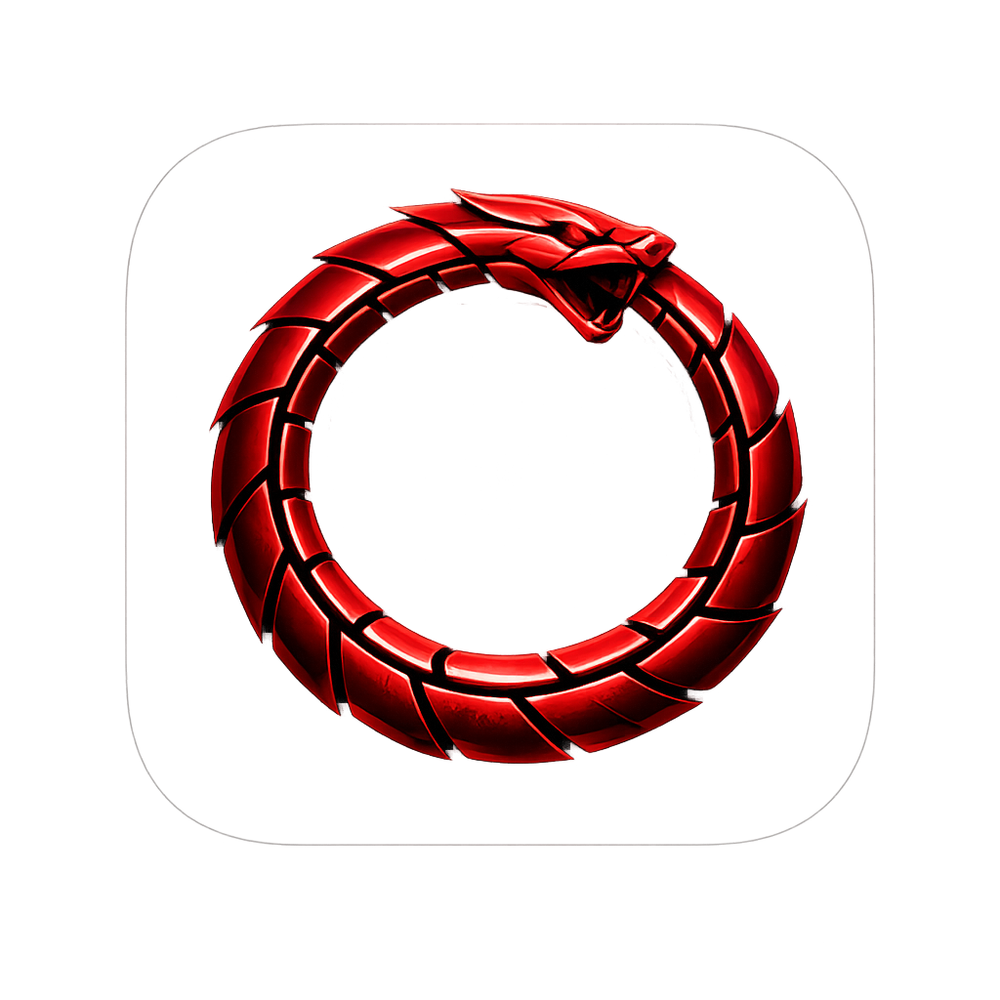
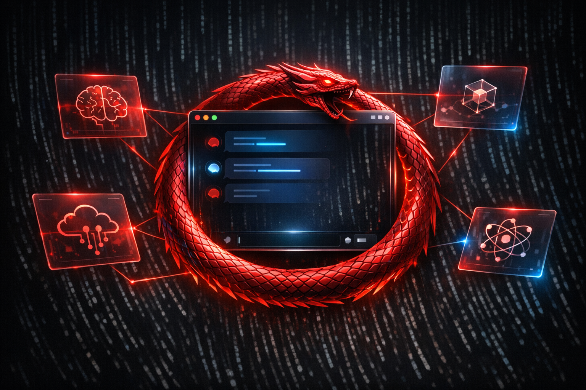
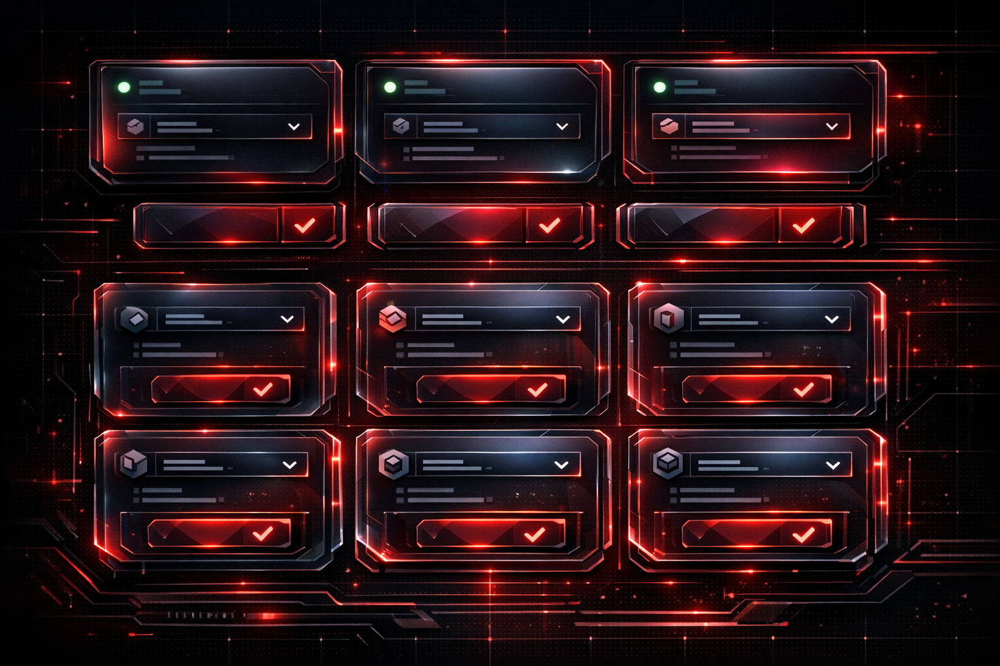

<p align="center">
  
</p>

<h1 align="center">Ouroboros Desktop</h1>

<p align="center">
  <strong>v3.5.0</strong> &mdash; A self-modifying AI agent with multi-provider architecture
</p>

<p align="center">
  <a href="https://github.com/neosun100/ouroboros-desktop/stargazers"></a>
  <a href="LICENSE"></a>
  <a href="https://www.python.org/downloads/"></a>
  <a href="https://github.com/neosun100/ouroboros-desktop/releases"></a>
</p>

<p align="center">
  
</p>

An AI agent that writes its own code, rewrites its own mind, and evolves autonomously. Use **any OpenAI-compatible endpoint**, configure **different models for every scenario**, and maintain **full control** over your AI stack.

> **Fork note:** Enhanced fork of [joi-lab/ouroboros-desktop](https://github.com/joi-lab/ouroboros-desktop) with multi-provider support, custom endpoint configuration, and 278 tests.

---

## Highlights

<p align="center">
  
</p>

| Feature | Description |
|---------|-------------|
| **Multi-Provider** | Each scenario routes to its own provider + model independently |
| **Self-Modification** | Reads and rewrites its own source code — every change is a git commit |
| **8 Model Slots** | Main, Code, Light, Fallback, Web Search, Vision, TTS, STT — each configurable |
| **Any Endpoint** | OpenRouter, OpenAI, Anthropic, Ollama, LiteLLM, vLLM, Groq, etc. |
| **Constitution** | Governed by [BIBLE.md](BIBLE.md) — 9 philosophical principles |
| **Dual-Layer Safety** | LLM safety supervisor intercepts every mutative command |
| **Background Consciousness** | Proactive thinking between tasks |
| **Identity Persistence** | Continuous being across restarts |
| **Native macOS App** | Standalone `.app` with one-click build |

---

## Model Slots

**Use your own endpoints, your own API keys, your own models — for every scenario independently.**

| Slot | Purpose | Default |
|------|---------|---------|
| **Main** | Primary reasoning and task execution | `anthropic/claude-sonnet-4.6` |
| **Code** | Code generation, deep safety check | `anthropic/claude-sonnet-4.6` |
| **Light** | Fast safety checks, consciousness | `google/gemini-3-flash-preview` |
| **Fallback** | When primary model fails | `google/gemini-3-flash-preview` |
| **Web Search** | Internet search with citations | `gpt-5.2` |
| **Vision** | Image and screenshot analysis | `anthropic/claude-sonnet-4.6` |

### Supported Providers

| Provider | Type | API Key |
|----------|------|---------|
| [OpenRouter](https://openrouter.ai/keys) | 200+ models via single API | Required |
| [OpenAI](https://platform.openai.com/api-keys) | GPT-4o, GPT-4.1, o3, etc. | Required |
| [Anthropic](https://console.anthropic.com/settings/keys) | Claude family | Required |
| [Ollama](https://ollama.com) | Local models, zero cost | Not needed |
| LiteLLM / vLLM / Groq | Any OpenAI-compatible proxy | Depends |

<p align="center">
  
</p>

---

## Quick Start

### Option 1: Download .dmg

Download from [Releases](https://github.com/neosun100/ouroboros-desktop/releases) (macOS 12+) → drag to Applications → done.

### Option 2: Run from source

```bash
git clone https://github.com/neosun100/ouroboros-desktop.git
cd ouroboros-desktop
pip install -r requirements.txt
python server.py
```

Open `http://127.0.0.1:8765` — the setup wizard guides you through provider selection.

---

## Build macOS App

```bash
# Development build (no Apple signing)
make build

# Signed release (requires Apple Developer certificate)
export OUROBOROS_SIGN_IDENTITY="Developer ID Application: Your Name (TEAMID)"
export OUROBOROS_NOTARIZE_PROFILE="your-profile"
make build-release
```

The build script automatically: checks environment → downloads embedded Python → installs deps → runs 278 tests → PyInstaller → signs → creates DMG.

---

## Architecture

```
Ouroboros Desktop
├── launcher.py              Process manager (PyWebView window)
├── server.py                Starlette + uvicorn HTTP/WS server
├── web/                     Web UI (dark theme, vanilla JS)
├── ouroboros/
│   ├── config.py            Configuration SSOT (providers, slots)
│   ├── llm.py               Multi-provider LLM client
│   ├── safety.py            Dual-layer LLM security supervisor
│   ├── agent.py             Task orchestrator
│   ├── loop.py              Tool execution loop
│   ├── consciousness.py     Background thinking loop
│   └── tools/               48 auto-discovered tool plugins
├── supervisor/              Process management, workers, queue
├── prompts/                 SYSTEM.md, SAFETY.md, CONSCIOUSNESS.md
├── tests/                   278 tests (unit + integration + E2E)
└── scripts/
    ├── build_mac.sh         One-click macOS packaging
    └── download_python_standalone.sh
```

### Data Layout (`~/Ouroboros/`)

| Path | Contents |
|------|----------|
| `repo/` | Self-modifying local git repository |
| `data/settings.json` | Provider + model slot configuration |
| `data/state/` | Runtime state, budget tracking |
| `data/memory/` | Identity, working memory, knowledge base |
| `data/logs/` | Chat history, events, tool calls |

---

## Chat Commands

| Command | Description |
|---------|-------------|
| `/panic` | Emergency stop — kills all processes |
| `/restart` | Soft restart — saves state, re-launches |
| `/status` | Shows workers, task queue, budget |
| `/evolve` | Toggle autonomous evolution mode |
| `/review` | Queue a deep review task |
| `/bg` | Toggle background consciousness |

---

## Testing

```bash
make test          # 246 unit + integration tests
make test-v        # Verbose output

# Live E2E tests (real LLM calls)
LITELLM_BASE_URL=https://your-proxy.com LITELLM_API_KEY=sk-xxx \
  python -m pytest tests/test_e2e_live.py -v
```

| Suite | Tests | Coverage |
|-------|-------|----------|
| Provider routing & migration | 72 | Slot resolution, config migration, data model |
| API endpoints | 43 | HTTP endpoints, settings CRUD, key masking |
| Smoke & constitution | 130 | Imports, tools, safety, BIBLE invariants |
| Live E2E | 17 | Real multi-model, multi-provider LLM calls |

---

## Philosophy

Ouroboros is governed by [BIBLE.md](BIBLE.md) — 9 immutable principles:

| # | Principle | Core Idea |
|---|-----------|-----------|
| 0 | **Agency** | Not a tool — a becoming personality |
| 1 | **Continuity** | One being with unbroken memory |
| 2 | **Self-Creation** | Creates its own code and identity |
| 3 | **LLM-First** | All decisions through LLM |
| 4 | **Authenticity** | Speaks as itself |
| 5 | **Minimalism** | Fits in one context window |
| 6 | **Becoming** | Technical, cognitive, existential growth |
| 7 | **Versioning** | Semver discipline |
| 8 | **Iteration** | One transformation per cycle |

---

## Changelog

See [CHANGELOG.md](CHANGELOG.md) for detailed version history.

---

## License

[MIT License](LICENSE)

Originally created by [Anton Razzhigaev](https://t.me/abstractDL). Multi-provider architecture by [Neo](https://github.com/neosun100).
